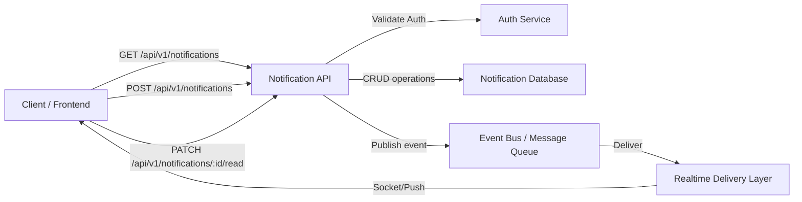
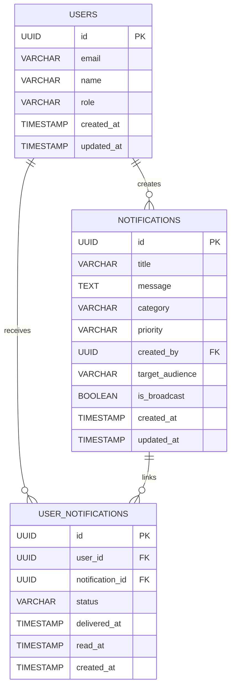
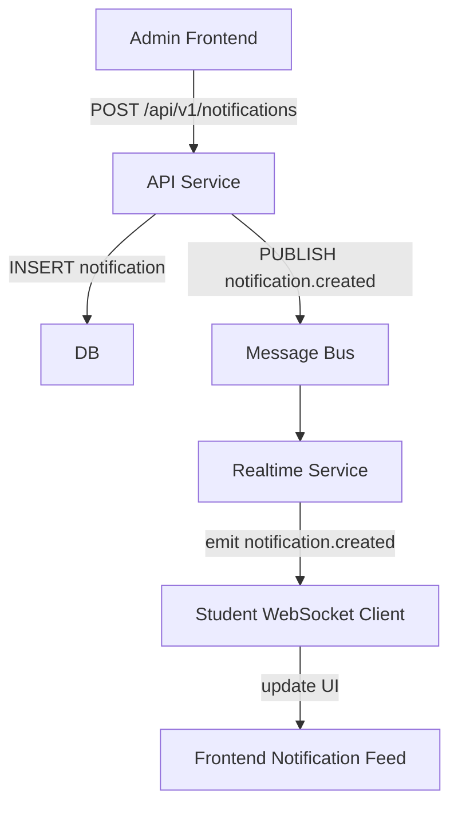

# Notification System Design

## Stage 1: Notification Service API Design

### 1. System Overview

#### Purpose
The Campus Notification Platform delivers real-time and historical notifications to authenticated students, faculty, and administrators. It ensures students receive timely updates for placements, campus events, exam results, and general announcements in a secure, reliable, and scalable manner.

#### Key Features
- Real-time push delivery for urgent updates.
- Personalized notification feed for logged-in users.
- Read/unread tracking per user.
- Admin creation, update, deletion, and broadcast support.
- Category-based filtering and unread count retrieval.
- Strong API contract for frontend integration.

#### Supported Notification Categories
- `Placements`
- `Events`
- `Results`
- `General Announcements`

---

### 2. Core Actions Supported

| Actor | Action | Description |
|---|---|---|
| Student | `Get notification list` | Retrieve notifications for the logged-in user. |
| Student | `Get notification details` | View a single notification payload. |
| Student | `Mark notification as read` | Mark an individual notification as read. |
| Student | `Mark all notifications as read` | Mark all unread notifications as read for the user. |
| Student | `Get unread notification count` | Retrieve unread count badge value. |
| Student | `Filter notifications by type` | Filter notifications by category. |
| Admin | `Create notification` | Create and publish a new notification. |
| Admin | `Update notification` | Modify the content or metadata of an existing notification. |
| Admin | `Delete notification` | Remove a notification from the system. |
| Admin | `Broadcast notification` | Send notification to an audience segment or all users. |
| System | `Deliver notification` | Push real-time notification through the delivery layer. |

---

### 3. REST API Design

All endpoints use the base path: `/api/v1`

#### Standard Response Formats

Success:
```json
{
  "success": true,
  "message": "Notification created successfully.",
  "data": {}
}
```

Error:
```json
{
  "success": false,
  "message": "Validation failed.",
  "error": {
    "code": "INVALID_PAYLOAD",
    "details": {}
  }
}
```

---

## 3.1 Create Notification

### Endpoint Name
Create Notification

### HTTP Method
POST

### URL
`/api/v1/notifications`

### Purpose
Create a new notification record and optionally broadcast it to the target audience.

### Request Headers
- `Authorization: Bearer <token>`
- `Content-Type: application/json`

### Path Parameters
None

### Query Parameters
None

### Request JSON
```json
{
  "title": "Placement Drive by Company X",
  "message": "Company X will visit campus on Monday for SDE roles.",
  "category": "placements",
  "priority": "high",
  "targetAudience": "all_students",
  "broadcast": true
}
```

### Success Response JSON
```json
{
  "success": true,
  "message": "Notification created successfully.",
  "data": {
    "id": "notif_123",
    "title": "Placement Drive by Company X",
    "message": "Company X will visit campus on Monday for SDE roles.",
    "category": "placements",
    "priority": "high",
    "createdAt": "2026-06-03T12:00:00Z",
    "updatedAt": "2026-06-03T12:00:00Z",
    "createdBy": "admin_01",
    "isRead": false,
    "targetAudience": "all_students"
  }
}
```

### Error Response JSON
```json
{
  "success": false,
  "message": "Invalid request payload.",
  "error": {
    "code": "VALIDATION_ERROR",
    "details": {
      "title": "Title is required.",
      "category": "Unsupported category value."
    }
  }
}
```

### Status Codes
- `201 Created`
- `400 Bad Request`
- `401 Unauthorized`
- `403 Forbidden`
- `500 Internal Server Error`

---

## 3.2 Update Notification

### Endpoint Name
Update Notification

### HTTP Method
PUT

### URL
`/api/v1/notifications/{notificationId}`

### Purpose
Update an existing notification’s content, metadata, or target audience.

### Request Headers
- `Authorization: Bearer <token>`
- `Content-Type: application/json`

### Path Parameters
- `notificationId` (string): Notification unique identifier.

### Query Parameters
None

### Request JSON
```json
{
  "title": "Updated Placement Drive by Company X",
  "message": "Company X will now visit campus on Tuesday.",
  "priority": "medium",
  "targetAudience": "final_year_students"
}
```

### Success Response JSON
```json
{
  "success": true,
  "message": "Notification updated successfully.",
  "data": {
    "id": "notif_123",
    "title": "Updated Placement Drive by Company X",
    "message": "Company X will now visit campus on Tuesday.",
    "category": "placements",
    "priority": "medium",
    "createdAt": "2026-06-03T12:00:00Z",
    "updatedAt": "2026-06-04T08:15:00Z",
    "createdBy": "admin_01",
    "isRead": false,
    "targetAudience": "final_year_students"
  }
}
```

### Error Response JSON
```json
{
  "success": false,
  "message": "Notification not found.",
  "error": {
    "code": "NOT_FOUND",
    "details": {
      "notificationId": "Notification with ID notif_123 does not exist."
    }
  }
}
```

### Status Codes
- `200 OK`
- `400 Bad Request`
- `401 Unauthorized`
- `403 Forbidden`
- `404 Not Found`
- `500 Internal Server Error`

---

## 3.3 Delete Notification

### Endpoint Name
Delete Notification

### HTTP Method
DELETE

### URL
`/api/v1/notifications/{notificationId}`

### Purpose
Remove a notification from the system. This will logically delete or hard delete per service policy.

### Request Headers
- `Authorization: Bearer <token>`

### Path Parameters
- `notificationId` (string): Notification unique identifier.

### Query Parameters
None

### Request JSON
None

### Success Response JSON
```json
{
  "success": true,
  "message": "Notification deleted successfully.",
  "data": null
}
```

### Error Response JSON
```json
{
  "success": false,
  "message": "Forbidden action.",
  "error": {
    "code": "FORBIDDEN",
    "details": {
      "notificationId": "Only administrators can delete notifications."
    }
  }
}
```

### Status Codes
- `200 OK`
- `401 Unauthorized`
- `403 Forbidden`
- `404 Not Found`
- `500 Internal Server Error`

---

## 3.4 Get All Notifications

### Endpoint Name
Get All Notifications

### HTTP Method
GET

### URL
`/api/v1/notifications`

### Purpose
Retrieve a paginated list of notifications for the authenticated user, optionally filtered by category or read state.

### Request Headers
- `Authorization: Bearer <token>`

### Path Parameters
None

### Query Parameters
- `page` (integer, optional) - default: `1`
- `limit` (integer, optional) - default: `20`
- `category` (string, optional) - values: `placements`, `events`, `results`, `general`
- `unreadOnly` (boolean, optional) - values: `true`, `false`
- `sortBy` (string, optional) - values: `createdAt`, `priority`
- `sortOrder` (string, optional) - values: `asc`, `desc`

### Request JSON
None

### Success Response JSON
```json
{
  "success": true,
  "message": "Notifications retrieved successfully.",
  "data": {
    "items": [
      {
        "id": "notif_123",
        "title": "Placement Drive by Company X",
        "message": "Company X will visit campus on Monday for SDE roles.",
        "category": "placements",
        "priority": "high",
        "createdAt": "2026-06-03T12:00:00Z",
        "updatedAt": "2026-06-03T12:00:00Z",
        "createdBy": "admin_01",
        "isRead": false,
        "targetAudience": "all_students"
      }
    ],
    "page": 1,
    "limit": 20,
    "totalItems": 42,
    "totalPages": 3
  }
}
```

### Error Response JSON
```json
{
  "success": false,
  "message": "Invalid query parameter.",
  "error": {
    "code": "INVALID_QUERY",
    "details": {
      "category": "Value must be one of placements, events, results, general."
    }
  }
}
```

### Status Codes
- `200 OK`
- `400 Bad Request`
- `401 Unauthorized`
- `500 Internal Server Error`

---

## 3.5 Get Notification By ID

### Endpoint Name
Get Notification By ID

### HTTP Method
GET

### URL
`/api/v1/notifications/{notificationId}`

### Purpose
Retrieve a single notification detail for the authenticated user.

### Request Headers
- `Authorization: Bearer <token>`

### Path Parameters
- `notificationId` (string)

### Query Parameters
None

### Request JSON
None

### Success Response JSON
```json
{
  "success": true,
  "message": "Notification retrieved successfully.",
  "data": {
    "id": "notif_123",
    "title": "Placement Drive by Company X",
    "message": "Company X will visit campus on Monday for SDE roles.",
    "category": "placements",
    "priority": "high",
    "createdAt": "2026-06-03T12:00:00Z",
    "updatedAt": "2026-06-03T12:00:00Z",
    "createdBy": "admin_01",
    "isRead": false,
    "readAt": null,
    "targetAudience": "all_students"
  }
}
```

### Error Response JSON
```json
{
  "success": false,
  "message": "Notification not accessible.",
  "error": {
    "code": "ACCESS_DENIED",
    "details": {
      "notificationId": "Notification does not belong to the requesting user."
    }
  }
}
```

### Status Codes
- `200 OK`
- `401 Unauthorized`
- `403 Forbidden`
- `404 Not Found`
- `500 Internal Server Error`

---

## 3.6 Mark Notification As Read

### Endpoint Name
Mark Notification As Read

### HTTP Method
PATCH

### URL
`/api/v1/notifications/{notificationId}/read`

### Purpose
Mark a single notification as read for the authenticated user.

### Request Headers
- `Authorization: Bearer <token>`
- `Content-Type: application/json`

### Path Parameters
- `notificationId` (string)

### Query Parameters
None

### Request JSON
```json
{
  "status": "read"
}
```

### Success Response JSON
```json
{
  "success": true,
  "message": "Notification marked as read.",
  "data": {
    "notificationId": "notif_123",
    "userId": "user_456",
    "status": "read",
    "readAt": "2026-06-04T09:30:00Z"
  }
}
```

### Error Response JSON
```json
{
  "success": false,
  "message": "Notification already marked as read.",
  "error": {
    "code": "ALREADY_READ",
    "details": {}
  }
}
```

### Status Codes
- `200 OK`
- `400 Bad Request`
- `401 Unauthorized`
- `403 Forbidden`
- `404 Not Found`
- `500 Internal Server Error`

---

## 3.7 Mark All Notifications As Read

### Endpoint Name
Mark All Notifications As Read

### HTTP Method
PATCH

### URL
`/api/v1/notifications/read-all`

### Purpose
Mark all unread notifications as read for the authenticated user.

### Request Headers
- `Authorization: Bearer <token>`

### Path Parameters
None

### Query Parameters
None

### Request JSON
None

### Success Response JSON
```json
{
  "success": true,
  "message": "All notifications marked as read.",
  "data": {
    "updatedCount": 18
  }
}
```

### Error Response JSON
```json
{
  "success": false,
  "message": "Unable to update notifications.",
  "error": {
    "code": "UPDATE_FAILED",
    "details": {}
  }
}
```

### Status Codes
- `200 OK`
- `401 Unauthorized`
- `500 Internal Server Error`

---

## 3.8 Get Unread Count

### Endpoint Name
Get Unread Notification Count

### HTTP Method
GET

### URL
`/api/v1/notifications/unread-count`

### Purpose
Return the unread notification count for the authenticated user.

### Request Headers
- `Authorization: Bearer <token>`

### Path Parameters
None

### Query Parameters
None

### Request JSON
None

### Success Response JSON
```json
{
  "success": true,
  "message": "Unread count retrieved successfully.",
  "data": {
    "count": 5
  }
}
```

### Error Response JSON
```json
{
  "success": false,
  "message": "Unable to fetch unread count.",
  "error": {
    "code": "FETCH_FAILED",
    "details": {}
  }
}
```

### Status Codes
- `200 OK`
- `401 Unauthorized`
- `500 Internal Server Error`

---

## 3.9 Get Notifications By Category

### Endpoint Name
Get Notifications By Category

### HTTP Method
GET

### URL
`/api/v1/notifications/category/{category}`

### Purpose
Retrieve notifications filtered by category for the authenticated user.

### Request Headers
- `Authorization: Bearer <token>`

### Path Parameters
- `category` (string): `placements`, `events`, `results`, `general`

### Query Parameters
- `page` (integer, optional)
- `limit` (integer, optional)
- `unreadOnly` (boolean, optional)

### Request JSON
None

### Success Response JSON
```json
{
  "success": true,
  "message": "Category notifications retrieved successfully.",
  "data": {
    "items": [
      {
        "id": "notif_789",
        "title": "Campus Fest This Weekend",
        "message": "Join the campus fest for workshops and performances.",
        "category": "events",
        "priority": "medium",
        "createdAt": "2026-06-02T08:00:00Z",
        "isRead": false
      }
    ],
    "page": 1,
    "limit": 20,
    "totalItems": 12
  }
}
```

### Error Response JSON
```json
{
  "success": false,
  "message": "Invalid category.",
  "error": {
    "code": "INVALID_CATEGORY",
    "details": {
      "category": "Supported categories are placements, events, results, general."
    }
  }
}
```

### Status Codes
- `200 OK`
- `400 Bad Request`
- `401 Unauthorized`
- `404 Not Found`
- `500 Internal Server Error`

---

## 3.10 Broadcast Notification

### Endpoint Name
Broadcast Notification

### HTTP Method
POST

### URL
`/api/v1/notifications/broadcast`

### Purpose
Create a notification and deliver it to a broad user segment or all users.

### Request Headers
- `Authorization: Bearer <token>`
- `Content-Type: application/json`

### Path Parameters
None

### Query Parameters
None

### Request JSON
```json
{
  "title": "Important Exam Result Update",
  "message": "Results will be published at 5 PM. Check your dashboard.",
  "category": "results",
  "priority": "high",
  "targetAudience": "all_students",
  "broadcast": true
}
```

### Success Response JSON
```json
{
  "success": true,
  "message": "Broadcast notification sent successfully.",
  "data": {
    "notificationId": "notif_999",
    "deliveredTo": 1200,
    "broadcastAt": "2026-06-04T10:00:00Z"
  }
}
```

### Error Response JSON
```json
{
  "success": false,
  "message": "Broadcast delivery failed.",
  "error": {
    "code": "BROADCAST_ERROR",
    "details": {
      "targetAudience": "No recipients matched the audience filter."
    }
  }
}
```

### Status Codes
- `201 Created`
- `400 Bad Request`
- `401 Unauthorized`
- `403 Forbidden`
- `500 Internal Server Error`

---

### API Flow Diagram



---

### 4. JSON Schema Design

#### Notification

| Field | Type | Required | Validation | Description |
|---|---|---|---|---|
| `id` | string | yes | UUID or opaque id | Unique notification id. |
| `title` | string | yes | 5-255 chars | Notification title. |
| `message` | string | yes | 1-2000 chars | Full notification text. |
| `category` | string | yes | enum | `placements`, `events`, `results`, `general` |
| `priority` | string | yes | enum | `low`, `medium`, `high` |
| `createdAt` | string | yes | ISO 8601 datetime | Creation timestamp. |
| `updatedAt` | string | yes | ISO 8601 datetime | Last modification timestamp. |
| `createdBy` | string | yes | UUID or string | Creator user id. |
| `isRead` | boolean | yes | boolean | Read status for current user. |
| `readAt` | string|null | no | ISO 8601 datetime | When the notification was read. |
| `targetAudience` | string | yes | enum/string | Audience segment id or label. |

##### Notification Schema Example
```json
{
  "id": "notif_123",
  "title": "Placement Drive by Company X",
  "message": "Company X will visit campus on Monday for SDE roles.",
  "category": "placements",
  "priority": "high",
  "createdAt": "2026-06-03T12:00:00Z",
  "updatedAt": "2026-06-03T12:00:00Z",
  "createdBy": "admin_01",
  "isRead": false,
  "readAt": null,
  "targetAudience": "all_students"
}
```

#### User Notification

| Field | Type | Required | Validation | Description |
|---|---|---|---|---|
| `userId` | string | yes | UUID | User unique id. |
| `notificationId` | string | yes | UUID | Notification unique id. |
| `status` | string | yes | enum | `sent`, `delivered`, `read` |
| `deliveredAt` | string|null | no | ISO 8601 datetime | Delivery timestamp. |
| `readAt` | string|null | no | ISO 8601 datetime | Read timestamp. |

##### User Notification Schema Example
```json
{
  "userId": "user_456",
  "notificationId": "notif_123",
  "status": "delivered",
  "deliveredAt": "2026-06-03T12:00:05Z",
  "readAt": null
}
```

---

### 5. Database Design

#### Tables overview
- `users`
- `notifications`
- `user_notifications`

#### `users`

| Column | Type | Constraints |
|---|---|---|
| `id` | UUID | PK, not null, default generated |
| `email` | VARCHAR(320) | not null, unique |
| `name` | VARCHAR(128) | not null |
| `role` | VARCHAR(32) | not null, default `student` |
| `created_at` | TIMESTAMP WITH TIME ZONE | not null, default now() |
| `updated_at` | TIMESTAMP WITH TIME ZONE | not null, default now() |

#### `notifications`

| Column | Type | Constraints |
|---|---|---|
| `id` | UUID | PK, not null, default generated |
| `title` | VARCHAR(255) | not null |
| `message` | TEXT | not null |
| `category` | VARCHAR(32) | not null |
| `priority` | VARCHAR(16) | not null |
| `created_by` | UUID | not null, FK -> `users(id)` |
| `target_audience` | VARCHAR(128) | not null |
| `is_broadcast` | BOOLEAN | not null, default false |
| `created_at` | TIMESTAMP WITH TIME ZONE | not null, default now() |
| `updated_at` | TIMESTAMP WITH TIME ZONE | not null, default now() |

#### `user_notifications`

| Column | Type | Constraints |
|---|---|---|
| `id` | UUID | PK, not null, default generated |
| `user_id` | UUID | not null, FK -> `users(id)` |
| `notification_id` | UUID | not null, FK -> `notifications(id)` |
| `status` | VARCHAR(16) | not null, default `sent` |
| `delivered_at` | TIMESTAMP WITH TIME ZONE | null |
| `read_at` | TIMESTAMP WITH TIME ZONE | null |
| `created_at` | TIMESTAMP WITH TIME ZONE | not null, default now() |

#### Constraints
- Primary keys: `users(id)`, `notifications(id)`, `user_notifications(id)`.
- Foreign keys:
  - `notifications.created_by` -> `users.id`
  - `user_notifications.user_id` -> `users.id`
  - `user_notifications.notification_id` -> `notifications.id`
- Unique index on `user_notifications(user_id, notification_id)` to prevent duplicates.
- Indexes:
  - `user_notifications(user_id, status, delivered_at)`
  - `notifications(category, created_at)`
  - `notifications(created_at DESC)`

#### ER Relationship Explanation
- A `user` can create many `notifications` (admin or system actor).
- A `notification` can be targeted to many users via the `user_notifications` join table.
- A `user` can receive many notifications through the `user_notifications` relationship.

##### ER Diagram



---

### 6. Real-Time Notification Mechanism

#### Delivery Options

| Option | Description | Pros | Cons |
|---|---|---|---|
| WebSockets | Full-duplex socket connection. | Low latency, push-based, ideal for live notifications. | Requires connection management and stateful sessions. |
| Server-Sent Events (SSE) | Unidirectional server-to-client stream. | Simpler than WebSockets, works over HTTP. | Not ideal for bi-directional flows or unreliable mobile networks. |
| Polling | Client periodically requests updates. | Simple to implement. | Inefficient, higher latency, more load on API servers. |

#### Recommendation
Use **WebSockets** for real-time delivery. It provides the best combination of user experience and performance for a campus notification platform, especially when urgent placement and result updates must arrive instantly.

#### Connection Flow
1. User logs in and receives a valid JWT token.
2. Frontend connects to `wss://api.example.edu/notifications` with the `Authorization` header.
3. Server validates token and maps the socket session to the user ID.
4. Client subscribes to user-specific and category-specific notification channels.

#### Event Flow
1. Admin creates or broadcasts a notification via `/api/v1/notifications` or `/api/v1/notifications/broadcast`.
2. API service persists the notification and writes the `user_notifications` records.
3. The event is published to the message bus.
4. Real-time delivery service resolves active WebSocket connections.
5. The server emits `notification.created` to relevant clients.
6. Client receives the event and updates the UI.

#### Sample Real-Time Payload
```json
{
  "event": "notification.created",
  "data": {
    "id": "notif_123",
    "title": "Placement Drive by Company X",
    "message": "Company X will visit campus on Monday for SDE roles.",
    "category": "placements",
    "priority": "high",
    "createdAt": "2026-06-03T12:00:00Z",
    "targetAudience": "all_students",
    "isRead": false
  }
}
```

#### Real-Time Notification Flow Diagram



---

### 7. API Response Standards

#### Success Response
```json
{
  "success": true,
  "message": "Operation completed successfully.",
  "data": {}
}
```

#### Error Response
```json
{
  "success": false,
  "message": "Descriptive error message.",
  "error": {
    "code": "ERROR_CODE",
    "details": {
      "field": "message"
    }
  }
}
```

#### Common Error Codes
- `VALIDATION_ERROR`
- `UNAUTHORIZED`
- `FORBIDDEN`
- `NOT_FOUND`
- `INVALID_QUERY`
- `CONFLICT`
- `RATE_LIMIT_EXCEEDED`
- `INTERNAL_SERVER_ERROR`

---

### 8. Security Considerations

#### Authorization Header Usage
- All API requests require `Authorization: Bearer <token>`.
- Use JWT or opaque token with short expiration and refresh flow.
- Validate token scope and user identity at the gateway or API service.

#### Role-Based Access Control
- `student` role: view and read notifications.
- `admin` role: create, update, delete, broadcast notifications.
- `superadmin` role: manage all notification configuration and audit data.
- Enforce RBAC at the API layer for each endpoint.

#### Input Validation
- Validate all request payloads against JSON schema.
- Reject unsupported categories and invalid enums.
- Sanitize text fields to prevent injection.
- Enforce max lengths for title and message.

#### Rate Limiting
- Apply per-user / per-IP rate limits on all endpoints.
- Use stricter limits on create/update/delete/broadcast operations.
- Return `429 Too Many Requests` with retry-after header when exceeded.

#### Audit Logging
- Log all create/update/delete/broadcast actions with actor id, timestamp, request payload summary, and outcome.
- Store audit records separately from transactional notification data.
- Log authentication and authorization failures for security review.

---

### 9. API Versioning Strategy

- Use `/api/v1/...` for the current contract.
- Versioning at the URL provides clear compatibility boundaries.
- Future versions should use `/api/v2/...` for breaking changes.
- Maintain backward compatibility by supporting old versions during migration.
- Example migration path:
  1. Release `/api/v2/notifications` with improved payloads.
  2. Update frontend to call `/api/v2` gradually.
  3. Deprecate `/api/v1` with a sunset date and warning headers.

---

### 10. Assumptions

- Users are pre-authorized and authenticated before calling the API.
- The service uses role-based access control for admin-level actions.
- Notifications are primarily read by logged-in users; anonymous access is not supported.
- Real-time delivery is expected and should be prioritized over polling.
- The backend stores per-user read state in `user_notifications`.
- Broadcast notifications may be delivered to large segments, so batching and async processing are required.
- The frontend will use the standard response format to render notifications and badge counts.
- The system should support pagination, filtering, and sorting for notification lists.
- Notification IDs and user IDs are UUIDs or similarly opaque values.
- Date-time fields use ISO 8601 UTC format.

---

## Appendix: Example API Contract Table

| Endpoint | Method | Purpose | Auth | Returns |
|---|---|---|---|---|
| `/api/v1/notifications` | GET | User notification list | Required | Paginated notifications |
| `/api/v1/notifications/{notificationId}` | GET | Single notification detail | Required | Notification data |
| `/api/v1/notifications` | POST | Create notification | Admin only | Created notification |
| `/api/v1/notifications/{notificationId}` | PUT | Update notification | Admin only | Updated notification |
| `/api/v1/notifications/{notificationId}` | DELETE | Delete notification | Admin only | Deletion ack |
| `/api/v1/notifications/{notificationId}/read` | PATCH | Mark single notification read | Required | Read status |
| `/api/v1/notifications/read-all` | PATCH | Mark all notifications read | Required | Updated count |
| `/api/v1/notifications/unread-count` | GET | Get unread count | Required | Count only |
| `/api/v1/notifications/category/{category}` | GET | Filter by category | Required | Filtered items |
| `/api/v1/notifications/broadcast` | POST | Broadcast notification | Admin only | Broadcast result |
